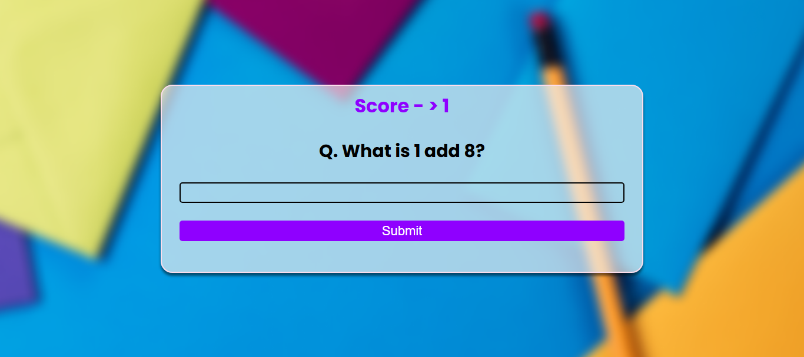

# 🧠 Quiz App

 

A fun and interactive Quiz App that tests your knowledge with multiple-choice questions.  
Built using HTML, CSS, and JavaScript with real-time score tracking and result display.

 

## 🚀 Features

- Multiple-choice questions with one correct answer
- Instant feedback on each selection
- Score counter with result display at the end
- Option to restart the quiz
- Mobile-friendly responsive layout

 

## 🛠️ Built With

- HTML
- CSS
- JavaScript

 

## 📷 Screenshot

 

## 📄 License

This project is licensed under the MIT License – see the [LICENSE](LICENSE) file for details.
